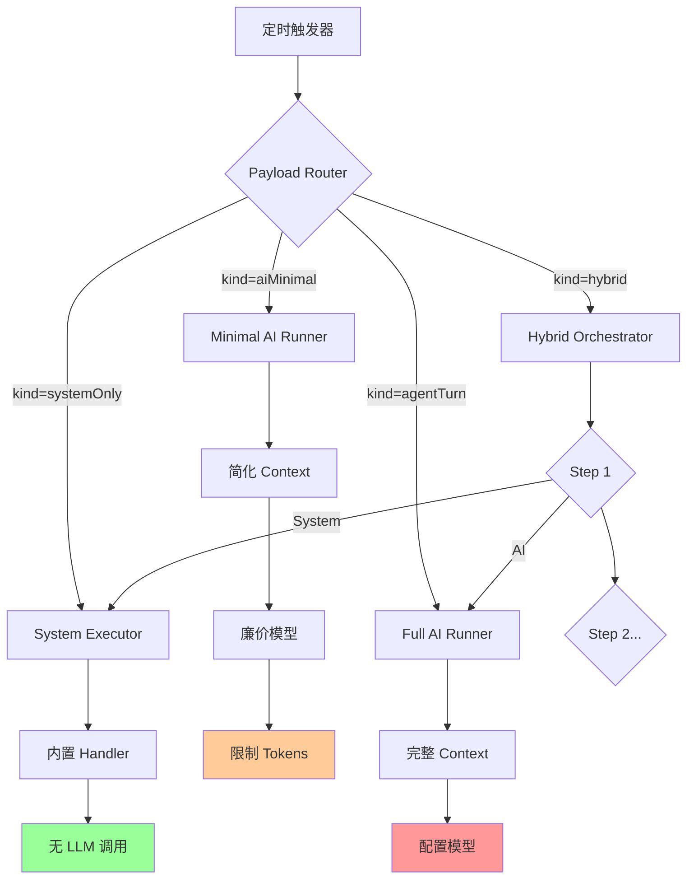
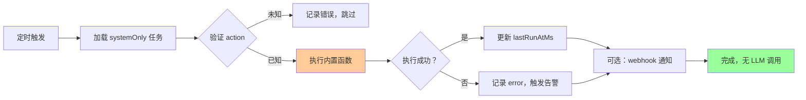
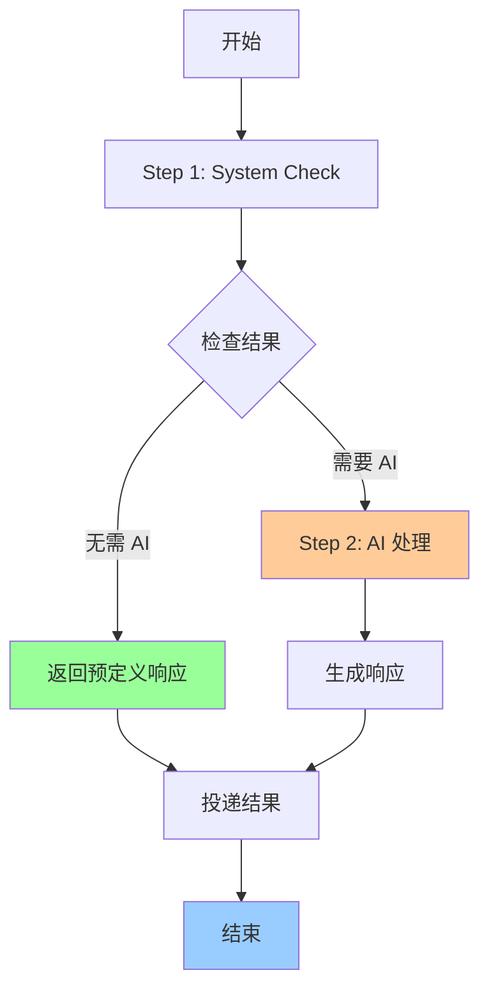

# Cron 零 TOKEN 任务类型系统设计方案

**创建时间**: 2026-03-06  
**状态**: 设计方案（未实现）  
**目的**: 通过任务类型分层，在保证功能的前提下最大化节省 TOKEN 消耗

---

## 一、设计背景与动机

### 1.1 问题陈述

当前 OpenClaw 的所有 cron 定时任务都会消耗TOKEN，因为：
- 所有任务类型 (`agentTurn`, `systemEvent`) 最终都会调用 LLM API
- 即使简单的健康检查、数据清理等任务也需要经过完整的 AI 流程
- 无法为不同场景选择合适的执行策略

### 1.2 核心目标

设计专门的任务类型系统，根据任务本质匹配适当的执行策略：
1. **能不用 AI 就不用** → `systemOnly`
2. **能用小模型就用小模型** → `aiMinimal`
3. **必须用才用** → `aiFull`
4. **聪明地用** → `hybrid`

### 1.3 预期收益

**TOKEN 节省估算**（假设 100 个定时任务）：
```
- 40% systemOnly → 节省 40% × 100% = 40%
- 30% aiMinimal  → 节省 30% × 90% = 27%
- 20% aiFull     → 无节省
- 10% hybrid     → 节省 10% × 50% = 5%

总节省：72% TOKEN 消耗
月度成本：$2000 → $560（节省 $1440/月）
```

---

## 二、任务类型系统架构

### 2.1 整体架构图

```
┌─────────────────────────────────────────┐
│         CronJob (统一入口)               │
├─────────────────────────────────────────┤
│  - id, name, schedule                   │
│  - payload (决定任务类型)                │
│  - delivery (结果投递)                   │
│  - state (运行状态)                      │
└─────────────────────────────────────────┘
              ↓
    ┌─────────┴──────────┬──────────────┬─────────────┐
    │                    │              │             │
    ▼                    ▼              ▼             ▼
┌──────────┐      ┌──────────┐   ┌──────────┐  ┌──────────┐
│systemOnly│      │aiMinimal │   │ aiFull   │  │ hybrid   │
│纯系统任务 │      │轻量 AI 任务│   │完整 AI 任务│  │混合任务  │
└──────────┘      └──────────┘   └──────────┘  └──────────┘
  零 TOKEN          低 TOKEN        标准 TOKEN     条件 TOKEN
```

### 2.2 执行流程图



---

## 三、四种任务类型详细规格

### 3.1 Type 1: `systemOnly` - 纯系统任务（零 TOKEN）

#### Payload 结构

```typescript
{
  kind: "systemOnly",
  action: string,           // 预定义的系统动作
  params?: Record<string, any>,
  timeoutSeconds?: number   // 超时控制
}
```

#### 支持的动作列表

| Action | 描述 | 示例参数 |
|--------|------|----------|
| `cleanup` | 清理过期数据/日志 | `{ table: "logs", olderThan: "7d" }` |
| `backup` | 数据库或配置备份 | `{ path: "/data/backup", compress: true }` |
| `healthCheck` | 健康检查 + 心跳上报 | `{ endpoint: "http://api/health" }` |
| `webhook` | 触发外部 Webhook | `{ url: "https://hooks.slack.com/...", method: "POST" }` |
| `rotate` | 轮换密钥/Token | `{ secretRef: "db-password" }` |
| `sync` | 同步本地状态到远程 | `{ target: "s3://bucket/path" }` |
| `notify` | 发送预定义消息 | `{ templateId: "backup-complete", vars: {...} }` |

#### 执行流程



#### 交付机制

```mermaid
sequenceDiagram
    participant T as Timer
    participant S as System Handler
    participant D as Dispatcher
    participant O as Outbound
    participant C as Channel
    participant U as User
    
    T->>S: 定时触发 systemOnly
    S->>S: 执行 action (如 notify)
    S->>S: 生成 outputText
    
    Note over S: 零 TOKEN 消耗
    
    S->>D: dispatchCronDelivery()
    
    alt mode=announce
        D->>O: deliverOutboundPayloads()
        O->>C: 通过 channel plugin 发送
        C->>U: IM 收到消息
    else mode=webhook
        D->>O: HTTP POST
        O->>外部系统：Webhook
    else mode=none
        D->>D: 跳过交付
    end
    
    Note over D,U: 复用现有 delivery 基础设施
```

#### 关键特性

- ✅ 不调用任何 LLM
- ✅ 不加载 bootstrap 上下文
- ✅ 不使用 session store
- ✅ 直接执行内置 handler
- ✅ 错误处理简单直接
- ✅ 复用现有 `dispatchCronDelivery` 和 `deliverOutboundPayloads`

---

### 3.2 Type 2: `aiMinimal` - 轻量 AI 任务（低 TOKEN）

#### Payload 结构

```typescript
{
  kind: "aiMinimal",
  message: string,
  templateId?: string,      // 使用预定义模板
  templateVars?: object,    // 模板变量
  lightContext: true,       // 强制轻量上下文
  skipSystemPrompt?: true,  // 跳过系统提示
  model?: string,           // 固定廉价模型
  maxTokens?: number        // 限制输出长度
}
```

#### 适用场景

| 场景 | 说明 | 预期 TOKEN |
|------|------|-----------|
| 简单分类 | "这是垃圾邮件吗？" | ~100-200 |
| 数据提取 | "从文本中提取日期" | ~150-300 |
| 短文本生成 | 推送通知标题 | ~200-400 |
| Yes/No 判断 | "是否需要人工介入？" | ~100-200 |

#### 执行优化措施

```typescript
// 在 src/cron/isolated-agent/run.ts 中的特殊处理
if (payload.kind === "aiMinimal") {
  // 1. 使用最简 system prompt（~50 tokens）
  // 2. 禁用工具调用（避免额外 API）
  // 3. 设置 max_tokens 限制
  // 4. 使用廉价模型（如 moonshot-8k）
  // 5. 跳过技能快照加载
  // 6. 禁用 verbose logging
}
```

#### TOKEN 对比

```
aiFull:    ~2000-5000 tokens/次
aiMinimal: ~200-500 tokens/次  （减少 90%）
```

---

### 3.3 Type 3: `aiFull` - 完整 AI 任务（当前默认）

保持现状，即现有的 `agentTurn` 类型。

#### Payload 结构（现有）

```typescript
{
  kind: "agentTurn",  // 保持不变
  message: string,
  model?: string,
  fallbacks?: string[],
  thinking?: string,
  timeoutSeconds?: number,
  allowUnsafeExternalContent?: boolean,
  lightContext?: boolean,  // 可选优化
  deliver?: boolean,
  channel?: CronMessageChannel,
  to?: string,
  bestEffortDeliver?: boolean
}
```

#### 适用场景

- 复杂推理任务
- 多步骤问题解决
- 需要工具调用的场景
- 长文本生成

---

### 3.4 Type 4: `hybrid` - 混合任务（条件 TOKEN）

#### 核心理念

先执行系统逻辑，根据结果决定是否调用 AI。

#### Payload 结构

```typescript
{
  kind: "hybrid",
  steps: [
    {
      type: "system" | "ai",
      action?: string,        // system 类型使用
      message?: string,       // ai 类型使用
      condition?: string,     // 条件表达式
      skipIf?: string         // 跳过条件
    }
  ],
  failFast?: boolean          // 失败立即停止
}
```

#### 执行流程



#### 实际应用示例

**示例 1: 智能告警（大部分时间不消耗TOKEN）**

```yaml
name: "数据库监控"
payload:
  kind: "hybrid"
  steps:
    - type: "system"
      action: "healthCheck"
      params:
        endpoint: "http://db:5432/health"
    - type: "ai"
      condition: "step1.status != 'ok'"
      message: "数据库异常，请分析日志并生成修复建议：${step1.logs}"
```

**示例 2: 日报生成（只在有新数据时调用 AI）**

```yaml
name: "每日总结"
payload:
  kind: "hybrid"
  steps:
    - type: "system"
      action: "query"
      params:
        sql: "SELECT * FROM events WHERE date = today"
    - type: "ai"
      condition: "step1.rows.length > 0"
      message: "基于以下事件生成日报：${step1.rows}"
      skipIf: "step1.rows.length === 0"
```

---

## 四、路由与分发机制

### 4.1 路由器设计

**代码位置建议**:
- 路由器：`src/cron/isolated-agent/router.ts`（新增）
- System handlers：`src/cron/system-handlers/`（新增目录）
- 现有 AI 逻辑：保持在 `src/cron/isolated-agent/run.ts`

### 4.2 交付复用

关键设计决策：**delivery 机制本身不关心内容是 AI 生成的还是系统生成的**

- 复用 `src/cron/isolated-agent/delivery-dispatch.ts`
- 复用 `src/cron/delivery.ts`
- 复用 `deliverOutboundPayloads` 和 `runSubagentAnnounceFlow`
- 只传递不同的 `outputText` 和 `telemetry`

---

## 五、配置与治理

### 5.1 全局配置（config.toml）

```toml
[cron]
# 默认任务类型
defaultKind = "aiFull"

# 各类任务的资源限制
[cron.limits]
systemOnly.timeoutSeconds = 30
aiMinimal.timeoutSeconds = 60
aiMinimal.maxTokens = 200
aiFull.timeoutSeconds = 600
hybrid.maxSteps = 5

# TOKEN 预算控制
[cron.budget]
dailyTokenLimit = 100000
aiMinimalDailyLimit = 20000
alertThresholdPercent = 80
```

### 5.2 任务级元数据

```typescript
interface CronJobMetadata {
  expectedTokenCost?: number;    // 预期 TOKEN 消耗
  actualTokenCost?: number;      // 实际消耗
  lastOptimizedAt?: number;      // 最后优化时间
  recommendedKind?: "systemOnly" | "aiMinimal" | "aiFull"; // 推荐类型
}
```

---

## 六、可观测性增强

### 6.1 指标收集

```typescript
interface CronMetrics {
  byType: {
    systemOnly: { count: number, avgDurationMs: number };
    aiMinimal: { count: number, avgTokens: number, avgCost: number };
    aiFull: { count: number, avgTokens: number, avgCost: number };
    hybrid: { count: number, skippedAiCount: number, tokenSavings: number };
  };
  tokenSavings: {
    daily: number;
    monthly: number;
    percentage: number;
  };
}
```

### 6.2 日志分级示例

```
[SYSTEM] healthCheck completed in 12ms (0 tokens)
[AI_MINIMAL] classification done: 180 tokens ($0.0002)
[AI_FULL] analysis completed: 3200 tokens ($0.0048)
[HYBRID] skipped AI step: condition not met (saved ~2000 tokens)
```

---

## 七、实施路线图

### 阶段 1：基础设施（2-3 周）

1. 定义新 payload 类型（`src/cron/types.ts`）
2. 实现 `systemOnly` handlers
3. 添加路由器框架
4. 编写单元测试

**里程碑**: 第一个零 TOKEN 任务运行成功

### 阶段 2：优化器（2 周）

1. 实现 `aiMinimal` 模式
2. 添加模板系统
3. 集成廉价模型
4. TOKEN 预算控制

**里程碑**: aiMinimal 任务 TOKEN 消耗降低 90%

### 阶段 3：混合引擎（3-4 周）

1. 实现条件表达式解析器
2. 构建工作流编排器
3. 添加步骤间数据传递
4. 错误恢复机制

**里程碑**: hybrid 任务支持条件分支

### 阶段 4：智能化（持续）

1. 基于历史数据推荐任务类型
2. 自动优化频繁任务
3. TOKEN 使用预测
4. 成本告警系统

**里程碑**: 智能推荐系统上线

---

## 八、风险与缓解

| 风险 | 影响 | 缓解措施 |
|------|------|----------|
| 向后兼容性 | 现有任务可能失效 | 保持 `agentTurn` 完全兼容，新旧并存 |
| 复杂度增加 | 维护成本上升 | 清晰的类型边界，充分的文档 |
| 误用风险 | 用户选错类型 | CLI 提供 `openclaw cron recommend <job>` 命令 |
| 性能回归 | 路由开销 | 基准测试确保 <5ms 额外延迟 |

---

## 九、关键代码修改清单

### 9.1 需要修改的文件

| 文件路径 | 修改内容 | 预估行数 |
|---------|---------|---------|
| `src/cron/types.ts` | 添加新 payload 类型定义 | +80 |
| `src/cron/isolated-agent/run.ts` | 添加路由逻辑 | +120 |
| `src/cron/system-handlers/` | 新建 handlers 目录 | 新增多个文件 |
| `src/cron/isolated-agent/router.ts` | 新建路由器 | ~150 |

### 9.2 复用的现有代码

| 文件路径 | 复用内容 | 无需修改 |
|---------|---------|---------|
| `src/cron/isolated-agent/delivery-dispatch.ts` | 交付分发 | ✅ |
| `src/cron/delivery.ts` | 交付计划解析 | ✅ |
| `src/cron/isolated-agent/delivery-target.ts` | 目标解析 | ✅ |
| `src/infra/outbound/deliver.ts` | 实际发送 | ✅ |

---

## 十、配置示例大全

### 10.1 systemOnly 示例

```yaml
# 健康检查 + 通知
[[cron.jobs]]
id = "daily-health-check"
name = "每日健康检查"
schedule = { cron = "0 */6 * * *" }

[cron.jobs.payload]
kind = "systemOnly"
action = "healthCheck"
params.endpoint = "http://api.internal/health"

[cron.jobs.delivery]
mode = "announce"
channel = "telegram"
to = "user:123456"

# Webhook 触发
[[cron.jobs]]
id = "slack-notify"
name = "Slack 通知"
schedule = { everyMs = 3600000 }

[cron.jobs.payload]
kind = "systemOnly"
action = "webhook"
params.url = "https://hooks.slack.com/services/..."
params.method = "POST"
params.headers.Content-Type = "application/json"

[cron.jobs.delivery]
mode = "webhook"
to = "https://hooks.slack.com/services/..."
```

### 10.2 aiMinimal 示例

```yaml
# 邮件分类
[[cron.jobs]]
id = "spam-classifier"
name = "垃圾邮件分类"
schedule = { everyMs = 300000 }

[cron.jobs.payload]
kind = "aiMinimal"
message = "判断这封邮件是否为垃圾邮件：${email.body}"
model = "moonshot-8k"
maxTokens = 50
lightContext = true

[cron.jobs.delivery]
mode = "announce"
channel = "email"
to = "admin@example.com"
```

### 10.3 hybrid 示例

```yaml
# 智能监控
[[cron.jobs]]
id = "smart-monitor"
name = "智能监控"
schedule = { everyMs = 60000 }

[cron.jobs.payload]
kind = "hybrid"
failFast = false

[[cron.jobs.payload.steps]]
type = "system"
action = "query"
params.sql = "SELECT error_count FROM metrics WHERE time > now() - 5m"

[[cron.jobs.payload.steps]]
type = "ai"
condition = "step1.error_count > 10"
message = "检测到 ${step1.error_count} 个错误，请分析原因并提供解决方案"
skipIf = "step1.error_count <= 10"

[cron.jobs.delivery]
mode = "announce"
channel = "pagerduty"
to = "oncall-team"
```

---

## 十一、技术债务管理

### 11.1 代码质量保障

- 保持类型安全，避免使用 `any`
- 为每个 handler 编写单元测试
- 添加集成测试验证端到端流程
- 基准测试确保性能不退化

### 11.2 文档要求

- 更新 `docs/cron/` 下所有相关文档
- 添加迁移指南（针对现有任务）
- 提供最佳实践示例
- 录制演示视频

---

## 十二、参考资源

### 12.1 相关文件位置

- 当前 cron 实现：`src/cron/`
- 交付机制：`src/cron/isolated-agent/delivery-dispatch.ts`
- 类型定义：`src/cron/types.ts`
- 执行逻辑：`src/cron/isolated-agent/run.ts`

### 12.2 外部参考

- 现有 delivery 系统：复用 `deliverOutboundPayloads`
- Announce 流程：复用 `runSubagentAnnounceFlow`
- Outbound 身份：复用 `resolveAgentOutboundIdentity`

---

## 十三、未来扩展方向

### 13.1 可能的扩展

1. **批处理模式**: 多个 systemOnly 任务批量执行
2. **依赖图**: 任务间的依赖关系管理
3. **版本控制**: 任务配置的版本管理和回滚
4. **A/B 测试**: 对比不同类型任务的效果

### 13.2 高级功能

1. **动态类型切换**: 根据执行历史自动调整任务类型
2. **成本优化器**: 基于预算自动选择最经济的模型
3. **预测性调度**: 基于负载预测调整执行时间
4. **跨任务缓存**: 共享中间结果减少重复计算

---

## 附录 A：术语表

| 术语 | 定义 |
|------|------|
| TOKEN | LLM API 的计费单位，分为 input/output/cache tokens |
| systemOnly | 完全不使用 LLM 的任务类型 |
| aiMinimal | 使用简化上下文的轻量 AI 任务 |
| aiFull | 完整的 AI 任务（当前默认） |
| hybrid | 混合系统和 AI 的混合任务 |
| delivery | 将任务结果发送到目标渠道的过程 |
| announce | 通过 subagent announce flow 交付 |

---

## 附录 B：决策记录

### B.1 为什么复用现有 delivery 机制？

**决策**: 完全复用 `dispatchCronDelivery` 和 `deliverOutboundPayloads`

**理由**:
1. 避免重复造轮子
2. 保持交付行为一致性
3. 减少测试和维护成本
4. delivery 层不关心内容来源

### B.2 为什么不直接扩展现有类型？

**决策**: 引入全新的 `kind` 字段值

**理由**:
1. 清晰的语义边界
2. 类型安全的模式匹配
3. 便于统计和分析
4. 向后兼容性更好

---

**文档版本**: 1.0  
**最后更新**: 2026-03-06  
**维护者**: OpenClaw Team
